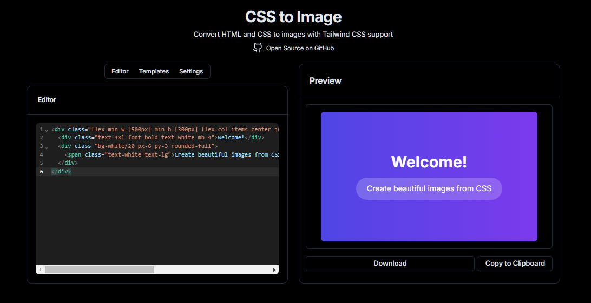

# CSS to Image

A web-based tool that converts HTML and CSS code into downloadable images, with built-in Tailwind CSS support.



## Features

- Live HTML/CSS code editor with syntax highlighting
- Real-time preview
- Multiple export formats (PNG, JPEG)
- Customizable image settings:
  - Quality control
  - Scale factor
  - Background color
  - Custom dimensions
- Built-in templates
- Copy to clipboard functionality
- Responsive design
- Dark mode support

## Tech Stack

- Next.js 15
- React 19
- TypeScript
- TailwindCSS
- React Textarea Code Editor for code editing
- Radix UI components
- html-to-image for conversion

## Getting Started

1. Clone the repository:
```bash
git clone https://github.com/devlsco/css-to-image.git
cd css-to-image
```

2. Install dependencies:
```bash
yarn
# or
npm i
```

3. Start the development server:
```bash
yarn dev
# or
npm run dev
```

4. Open [http://localhost:3000](http://localhost:3000) in your browser

## Building for Production

```bash
yarn build
yarn start
# or
npm run build
npm start
```

## License

This project is licensed under the MIT License - see the [LICENSE](LICENSE) file for details.

## Acknowledgments

- Built with [Next.js](https://nextjs.org/)
- UI components from [shadcn/ui](https://ui.shadcn.com/)
- Code editor powered by [React Textarea Code Editor/](https://uiwjs.github.io/react-textarea-code-editor/)
- Toast notifications by [Sonner](https://sonner.emilkowal.ski/)
